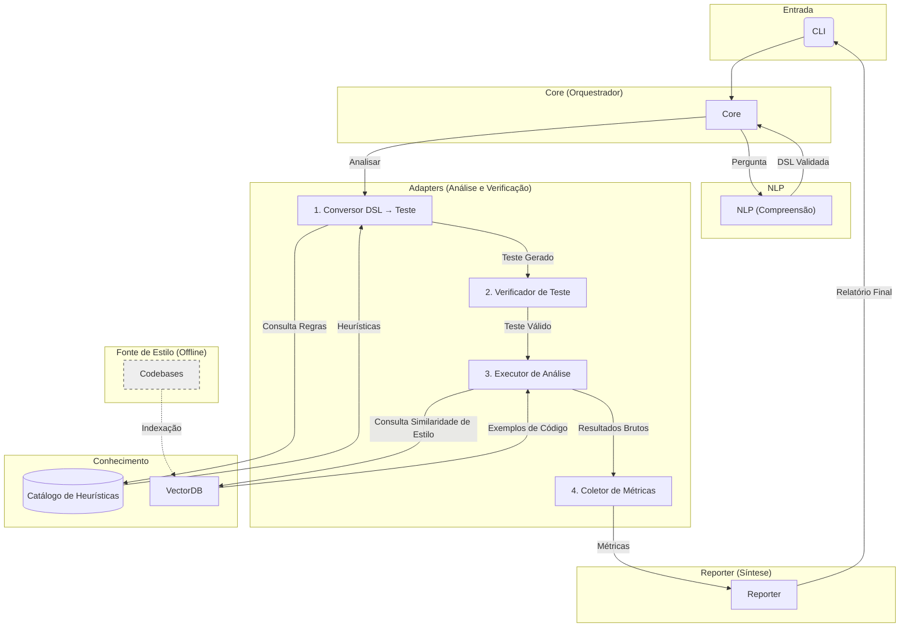

```mermaid
graph TD
    subgraph "Entrada"
        CLI("CLI")
    end

    subgraph "Core (Orquestrador)"
        C["Core"]
    end

    subgraph "NLP"
        N["NLP (Compreensão)"]
    end

    subgraph "Adapters (Análise e Verificação)"
        A1["1. Conversor DSL → Teste"]
        A2["2. Verificador de Teste"]
        A3["3. Executor de Análise"]
        A4["4. Coletor de Métricas"]
    end
    
    subgraph "Reporter (Síntese)"
        R["Reporter"]
    end

    subgraph "Conhecimento"
        KB[("Catálogo de Heurísticas")]
        VectorDB
    end

    subgraph "Fonte de Estilo (Offline)"
        Codebases
    end

    %% Fluxo Principal
    CLI --> C
    C -- "Pergunta" --> N
    N -- "DSL Validada" --> C
    C -- "Analisar" --> A1
    
    %% Fluxo de Análise Heurística (Regras Universais)
    A1 -- "Consulta Regras" --> KB
    KB -- "Heurísticas" --> A1
    A1 -- "Teste Gerado" --> A2
    A2 -- "Teste Válido" --> A3

    %% Fluxo de Análise de Estilo (RAG)
    A3 -- "Consulta Similaridade de Estilo" --> VectorDB
    VectorDB -- "Exemplos de Código" --> A3
    
    %% Coleta e Relatório
    A3 -- "Resultados Brutos" --> A4
    A4 -- "Métricas" --> R
    R -- "Relatório Final" --> CLI

    %% Fluxo de Indexação (Offline)
    Codebases -.->|Indexação| VectorDB

    %% Estilos
    style Codebases fill:#eee,stroke:#333,stroke-width:1px,stroke-dasharray: 5 5
```